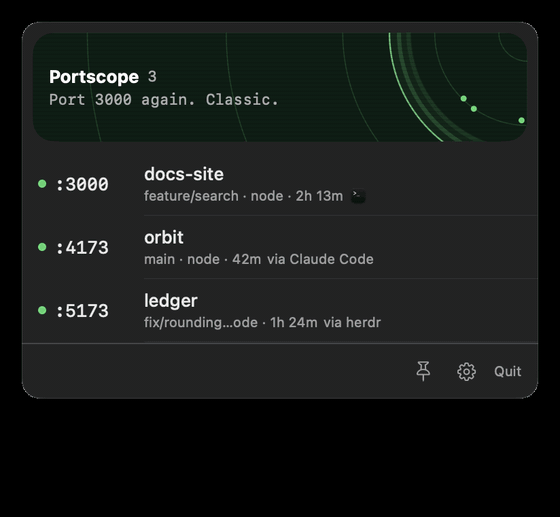

# Portscope

Menu bar radar for your dev servers. One scope of everything listening on localhost, with open, stop, and a bit of attitude.



Every listening TCP port owned by you becomes a row: port, project folder, git branch, process, uptime, and what started it (Claude Code, Cursor, Terminal, …). Servers whose parent has exited are marked **detached**, ports bound to all interfaces get a **network** badge, and the radar pings them all every few seconds.

## Install

Requires macOS 26 with Xcode or the Command Line Tools. No signing, no bundle.

```sh
git clone https://github.com/Fuasmattn/portscope.git
cd portscope
make install
```

That builds a release binary, copies it to `~/.local/bin/Portscope`, and loads a LaunchAgent so it starts now and at every login. `make restart` after pulling changes, `make uninstall` to remove everything.

To just try it once:

```sh
swift build -c release && .build/release/Portscope
```

## Use

Click the menu bar item, or press `Ctrl+Option+L`, to open the panel. Drag it by the radar card. It closes when it loses focus unless you pin it with the pin in the footer.

**On a row**

| Action | What happens |
|---|---|
| Click,&nbsp;`Space`,&nbsp;or&nbsp;the&nbsp;info&nbsp;button | Details popover: command, folder, PID, and the path to open for this port |
| `Return`&nbsp;or&nbsp;the&nbsp;open&nbsp;button | Opens it in the browser |
| Stop&nbsp;button,&nbsp;then&nbsp;**Stop** | Sends SIGTERM. Option-click sends SIGKILL. If the process ignores SIGTERM, a **Force kill** button appears |
| Right-click | Copy URL, port, or curl command. Open the folder in an editor or terminal. Pin. Hide by port, process, or project |

**Anywhere in the panel**

| Action | What happens |
|---|---|
| `Up`&nbsp;/&nbsp;`Down` | Selects a row. `Cmd+Backspace` stops it |
| `Cmd+F` | Filter by port, project, process, or branch. The field also appears on its own above 8 rows |
| `Esc` | Closes details, then clears the filter, then the selection, then the panel |
| Click&nbsp;a&nbsp;blip | Opens that server. Clicking empty scope sends a ping |
| Recently&nbsp;stopped | The last five servers you stopped, each with **Start again** |

Two processes on the same port from the same folder (IPv4 and IPv6, or a parent and its worker) collapse into one row marked **×2**; Stop signals both. Two *projects* on the same port are flagged **port conflict**.

Settings (gear in the footer): hotkey, reopen the panel where you left it, menu bar badge, a stale mark after N hours, system noise, click behaviour, refresh rate, radar on or off, reset hidden rules.

## Development

```sh
swift build          # debug
swift test           # needs Xcode; the Command Line Tools ship without XCTest
```

`Sources/PortscopeCore` is Foundation only: `lsof` and `ps` parsing, project detection, attribution, kill safety, list logic. `Sources/Portscope` is the SwiftUI and AppKit app. Design notes and decisions live in [SPEC.md](SPEC.md).

## Kill safety

Every row carries the process start time captured at scan time. Before signalling, Portscope re-reads it for that PID and aborts if it changed, so a reused PID is never killed. Only your own processes are listed. SIGKILL is never sent unless you ask for it.
